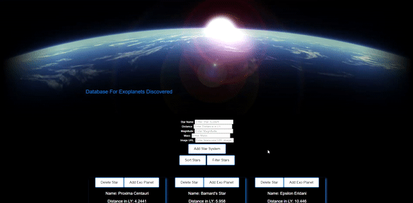
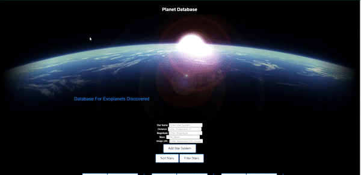

# Planet Database
This is an app that lets you add planets(specifically exo planets) to known star systems. This is a single page application with the Frontend built with HTML, CSS, and JavaScript and a backend with ruby on rails.

# Technologies
The following technologies were used in the production of Museum Manager:

- Ruby 2.7.2
- Rails 5.2.3
- Active Model Serializers

# Features
Currently, Planet Database has the following features implemented:

Users have the ability to add star systems with detailed information and a satellite/telescope image to the database.

A user can also add planets to their respective star systems

# Installation:

On a local machine:

- Clone this repo
- Navigate to the directory with `cd planet-database-api`
- Run `bundle install`
- Run `rake db:create` then `rake db:migrate`
- Run `rake db:seed`
- Open up a server of your choice

Link to the application itself: https://planet-database.herokuapp.com/
